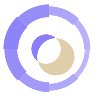

<div align="center">



# Aura · 奥拉

**一个有情绪、有记性的 Android AI 陪伴 App。**

会记住几个月前你说过的烦心事，会感知到你今天语气不太好，
会隔一段时间主动找你聊聊。不是聊天机器人，更像一个老朋友。

[官网](https://aura.gqy20.top) · [Releases](https://github.com/gqy20/Aura/releases) · [架构文档](docs/architecture.md) · [Roadmap](docs/roadmap.md)

</div>

<div align="center">

[](https://aura.gqy20.top)
[](https://github.com/gqy20/Aura/releases)
[](https://github.com/gqy20/Aura/actions)
[]()
[]()
[]()

</div>

---

## TL;DR

Aura 是 Android 上的 AI 陪伴 App，主线跑通三件事：

- **跨会话长期记忆** — 事实 / 时刻 / 习惯自动归档，回复前自动召回相关条目
- **后台 Dream Loop + 对话后即时洞察** — 6h 周期本地 Qwen 模式识别 + 每次对话结束 3 分钟后即时分析，生成 Insight 卡片
- **图 + 工具** — 发图能记住画面；Health Connect 步数 / 心率 / 睡眠；定时提醒；MCP server 可配置

云端走 Anthropic Messages 兼容接口（GLM / Kimi）；本地 Qwen（MNN 引擎）
作为可选 Provider，离线 / 低延迟 / 无 token 成本场景下用。

语音 I/O、主动 Pulse、动画角色 仍在路上。

---

## 目录

1. [它能做什么](#它能做什么)
2. [当前状态](#当前状态)
3. [怎么用](#怎么用)
4. [给开发者](#给开发者)
5. [文档](#文档)

---

## 它能做什么

按"使用频次"从高到低排序，6 项核心能力，每项都已在代码里跑通：

1. **长期记忆** — 跨会话记住你的偏好、习惯、重要的人和事
   - Room 存储记忆 + 摘要，每次回复都从 LTM 拉上下文；reflection 机制让 LLM 自己判断"什么值得记住"
2. **情绪感知** — 识别你当下的心情，对话风格随之调整
   - 情绪状态机持续更新，注入到 Prompt 让回复风格匹配你的状态（HAPPY / TIRED / SEARCHING …）
3. **关系模型** — 认识得越久，越懂你的说话方式
   - 关系亲密度 / 熟悉度随对话累积，影响称呼、语气、建议倾向
4. **图片理解** — 可以发图，能记住画面里的内容
   - Photo Picker 选图 → GLM-5v-turbo vision → 图像以 base64 落库，Dream Loop 把视觉证据注入下一轮上下文
5. **主动陪伴** — 到点提醒喝水、休息，偶尔主动发起对话
   - 已实现：Reminder（AlarmManager + Worker）；规划中：PulseWorker（按 Mood Trend 主动发消息）
6. **本地可选** — 不想上云？可切换到本地 Qwen 模型，离线 / 不消耗 token
   - MNN 推理引擎 + Qwen 模型自动下载（0.8B/2B/4B，首次 0.6–3.2 GB），支持文本 + Vision 多模态（2026-06-17 PR B）

---

## 当前状态

**最新版本：v0.1.4** · 561 个单元测试通过 · 0 失败 · CI: ✅ passing

| 模块 | 状态 | 说明 |
|------|------|------|
| 文本聊天闭环 | ✅ 完整 | Compose UI + ChatViewModel + CompanionRuntime + Koog Agent |
| 流式输出 | ✅ 完整 | Anthropic Messages 兼容 SSE，聊天气泡逐字渲染 |
| 长期记忆 | ✅ 完整 | MemoryRepository 统一保存 / 搜索 / prompt selection / 访问时间 |
| 情绪 / 关系 | ✅ 完整 | 状态机 + 关系模型已接入 Agent 主循环 |
| 图片理解 | ✅ MVP | Photo Picker 选图，CameraX 拍摄 UI 未做 |
| 设置 / 可观测性 | ✅ 完整 | Provider、API Key、连通性检查、数据导出 |
| Insight / Onboarding / Presence | ✅ 完整 | Dream Loop 周期 + POST_CHAT 即时洞察、Mood Trend、引导流程、Presence 反应策略 |
| Reminder | ✅ 完整 | AlarmManager + Worker + 通知 |
| Health Connect | ✅ 完整 | HealthDataSection + HealthSyncManager |
| 本地 LLM (Qwen MNN) | ✅ MVP | MNN 推理 + 模型下载器，UI 走 `Local Qwen` Provider |
| 语音 I/O (STT/TTS) | ❌ 未做 | 规划中 |
| PulseWorker (主动推送) | ❌ 未做 | 当前只有 Reminder 的 OneTimeWorkRequest |
| 动画角色 (Rive/Lottie) | ❌ 未做 | 主页用 Compose Canvas 临时替代 |
| 远程 Agent Server | ❌ 未做 | 规划中 |

详细进度见 [Roadmap](docs/roadmap.md)。

---

## 怎么用

### 前置条件

- Android 6.0+ 设备（minSdk 26）
- 至少一项 LLM 接入：
  - **云端**：[智谱 GLM](https://open.bigmodel.cn) 或 [Kimi](https://platform.moonshot.cn) 的 API Key
  - **本地**：首次启动下载 Qwen 模型（0.8B/2B/4B 可选，0.6–3.2 GB，存到应用私有目录）

### 1. 安装

```bash
# 克隆并构建
git clone https://github.com/gqy20/Aura.git
cd Aura
make run    # 构建 + 安装 + 启动
```

### 2. 第一次启动

1. 打开 App → 自动进入主页（首次会跑 Onboarding 5 问，用来建初始人设）
2. **设置页**（右上角齿轮）→ 选 Provider（GLM / Kimi / Local Qwen）→ 填 API Key → 点"连通性检查"
3. 回到主页 → 点底部 **+** 开始聊天
4. 发图：点输入框旁的图片按钮，从相册选

### 3. 进阶用法

- **查看情绪趋势**：主页 Insight 卡片短按弹层
- **管理记忆**：主页 → 记忆室，可查看/搜索所有 LTM 条目
- **配置 Reminder**：设置页 → 提醒，添加定时任务
- **数据导出 / 清空**：设置页 → 数据透明，支持 JSON 全量导出

---

## 给开发者

<details>
<summary><b>展开开发者文档（环境 / 命令 / 技术栈 / 流程 / 项目结构）</b></summary>

### 环境

- JDK 21+
- Android SDK（compileSdk 36, minSdk 26）
- Android Studio（推荐）或 Gradle 命令行

### 常用命令

```bash
./gradlew assembleDebug              # 构建 Debug APK
./gradlew testDebugUnitTest          # 跑 561 个单元测试
./gradlew connectedDebugAndroidTest  # 仪器测试（需连真机）
make run                              # 构建 + 安装 + 启动
make logcat                           # 查看应用日志
make benchmark-mnn                    # 按 scripts/mnn_benchmark.yml 跑本地模型 benchmark
make benchmark-aura                   # 解析 Aura 本机 LLM 日志
make help                             # 查看所有 make 命令
```

`make benchmark-mnn` / `python scripts/mnn_benchmark.py --mode app` 的顺序是：
1. `assembleDebug` 生成 `app-debug.apk`
2. 用 `D:\tools\ADB_Cli\adb.exe install -r` 直接安装 APK
3. 用 `adb shell am start` 启动主 App 进程 benchmark 入口
4. 从 `files/benchmarks/` 拉回结果 JSON

`scripts/mnn_benchmark.yml` 是 benchmark 的统一配置入口，常改参数如 `apk_path`、`app_package`、`model_name`、`prompt_len`、`decode_len`、`warmup_runs`、`measure_runs` 都放这里；命令行参数仍可临时覆盖。

### 技术栈

| 层 | 选型 | 选它的理由 |
|----|------|----------|
| UI | Jetpack Compose + Material 3 | 声明式 UI + 状态驱动，和 LLM 流式输出天然契合 |
| 架构 | MVVM + Repository | ViewModel + Flow + 单向数据流，单 Activity / 6 路由 NavHost |
| 并发 | Coroutines + Flow | 全异步；`Dispatchers.setMain` 在测试里手动替换 |
| Agent | [Koog](https://github.com/JetBrains/koog) 0.8.0 | JetBrains 官方 Agent 框架，原生支持工具调用 + 流式 |
| LLM | GLM-5v-turbo / Kimi 2.6 / 本地 Qwen (MNN) | 统一走 Anthropic Messages 兼容接口，本地走 MNN 引擎 |
| 数据 | Room + DataStore | 关系数据（消息/记忆/情绪）走 Room，配置项走 DataStore |
| DI | Hilt | 编译期依赖注入，Scope 划分清晰（Singleton / ViewModelScoped） |
| 后台 | WorkManager | Reminder / 数据同步 / Health 拉取都用 Worker |
| 相机 | CameraX | 规划中（当前走 Photo Picker） |
| 动画 | Lottie / Coil | 规划中（当前用 Compose Canvas） |

### 核心流程（一次对话）

```
用户输入（文本 / 图片）
  → MemoryRepository 选相关记忆 / 摘要
  → PromptBuilder 组装（注入情绪 + 关系 + 记忆）
  → Koog Agent 调用 LLM（流式，可用工具）
  → OutputParser 解析响应
  → 保存 assistant 消息
  → 情绪状态机更新
  → 关系模型更新
  → reflection 写入值得保留的新记忆
  → UI 渲染（气泡 / 表情 / "已记住" 提示）
```

### 项目结构

```
app/src/main/java/com/xiaoqi/companion/
├── feature/        # UI 层（chat / settings / home / memory / onboarding）
├── core/           # 核心逻辑
│   ├── companion/  #   CompanionRuntime 主循环 + Koog 集成
│   ├── llm/        #   Anthropic Messages 兼容 LLM client
│   ├── prompt/     #   Prompt 组装引擎 + 模板
│   └── tools/      #   Agent tools
├── data/           # 数据层（Room DAO/Entity、DataStore、Repository）
└── di/             # Hilt 模块
```

更详细的分层 / 数据流 / 模块依赖见 [docs/architecture.md](docs/architecture.md)。

</details>

---

## 文档

- [技术架构](docs/architecture.md) — 分层设计、Agent Core、数据流、模块清单
- [Benchmark](docs/benchmark.md) — 本地 MNN benchmark 流程与实测数据
- [Roadmap](docs/roadmap.md) — M0-M6 里程碑 + 当前进度
- [工程化规范](docs/engineering-standards.md) — CI/CD、测试策略、代码规范、质量门禁
- [Koog API 参考](docs/koog-api-reference.md) — Koog 0.8.0 完整 API 签名（从 Gradle 缓存 JAR 提取）
- [Agent ↔ Android 集成](docs/koog-android-integration.md) — Koog 在 Android 上的集成状态、线程规则、生命周期
- [Agent 编排层](docs/agent-architecture.md) — 云端 Agent 编排层（Provider 路由、Graph Strategy、Tool 系统、Memory Reflection、流式 UX 节流）

---

## License

Private
